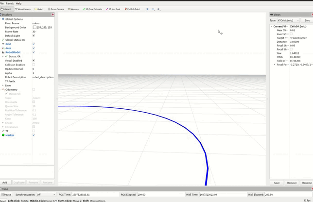
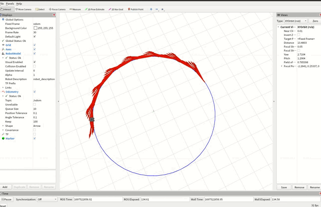

# stanley_controller

​	该项目是Stanley路径跟踪的仿真实现，基于开源的Turtlebot3模型，效果图如下

## 如何运行

- 第一步，新开一个终端，为终端1，并进入到你的工作目录中，举个例子：`cd /workspace/robot/src`
- 第二步，在工作目录中克隆turtlebot3的项目：`git clone  https://github.com/ROBOTIS-GIT/turtlebot3_msgs.git`   `git clone  https://github.com/ROBOTIS-GIT/turtlebot3.git`   `git clone https://github.com/ROBOTIS-GIT/turtlebot3_simulations.git`
- 第三步，把该项目也在该目录下克隆下来：`git clone https://github.com/Raiden49/stanley_controller.git`
- 第四步，进入到上一级目录：`cd ..`或者 `cd /workspace/robot`，构建：`cmake -B ./build -S ./src`，编译：`cmake --build build`
- 第五步，进入到该项目的目录下：`cd /workspace/robot/src/stanley_controller`，构建：`cmake -B ./build`， 编译：`cmake --build build`
- 第六步，`sudo gedit ~/.zshrc (bashrc)`，在最后添加：`export TURTLEBOT3_MODEL=waffle`
- 第七步，新开一个终端，为终端2，进入到工作目录中，`cd /workspace/robot/src`，然后：`source ./build/devel/setup.zsh(setup.bash) `
- 第八步，终端1，进入到该项目目录下：`cd /workspace/robot/src/stanley_controller`，然后：`source ./build/devel/setup.zsh(setup.bash) `
- 最后，终端2，先启动turtlebot3节点：`roslaunch turtlebot3_fake turtlebot3_fake.launch`；然后终端1，启动该项目节点：`roslaunch stanley_controller stanley_controller.launch `

